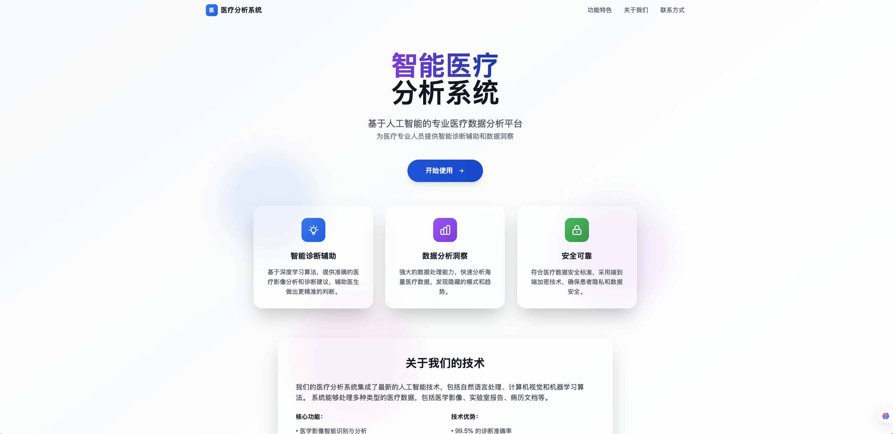

# 🏥 医疗报告智能分析系统

> 🏆 **NVIDIA 2025 Hackathon 年度总决赛参赛作品** - 基于NVIDIA NeMo Agent Toolkit构建的专业医疗报告分析系统

**🎯 官方竞赛链接**: [NVIDIA 2025 Hackathon 年度总决赛 - 开发者创新盛典](https://tianchi.aliyun.com/competition/entrance/532412)



## 🎯 项目简介

本项目是专为医疗健康领域开发的智能报告分析系统，基于NVIDIA官方NeMo Agent Toolkit技术栈构建。系统能够智能解析医疗报告、提供专业的健康建议，并基于用户位置推荐附近的医疗机构，是AI在医疗健康领域应用的典型示例。

### ✨ 核心特性

- 🩺 **医疗报告分析**: 支持PDF格式医疗报告上传和智能解析
- 🧠 **AI健康助手**: 基于NVIDIA NeMo Agent Toolkit的专业医疗对话
- 📍 **位置智能推荐**: 根据用户位置和症状推荐附近医院和科室
- 🔍 **医学信息搜索**: 集成Tavily API进行实时医学信息验证
- 📊 **健康指标分析**: 智能解读体检报告中的异常指标
- 🎨 **现代化界面**: 专业医疗UI设计，支持文档上传和实时对话

## 🏗️ 技术架构

### 前端技术栈
- **框架**: Next.js 14 + TypeScript
- **UI组件**: 基于NVIDIA官方UI组件库定制的医疗主题
- **文档处理**: PDF.js + 自研文本提取算法
- **特性**: 
  - 📄 PDF医疗报告上传和预览
  - 💬 实时医疗咨询对话
  - 🗂️ 历史报告管理
  - 🎨 医疗专业主题设计

### 后端技术栈
- **核心引擎**: [NVIDIA NeMo Agent Toolkit (NAT)](https://github.com/NVIDIA/NeMo-Agent-Toolkit)
- **工作流**: React Agent 智能决策引擎
- **专业工具集**: 
  - 🔍 Tavily医疗信息搜索
  - 📍 位置服务和医院推荐
  - ⏰ 时间查询服务
  - 📋 文档解析引擎

### AI模型支持
- **推荐模型**: 阿里云百炼 Qwen系列 (医疗场景优化)
- **兼容性**: 支持任何OpenAI格式的API
- **自定义**: 用户可配置专属API密钥和模型参数

## 🚀 快速开始

### 📋 环境要求

- **Python**: 3.12+
- **Node.js**: 18+
- **Git**: 最新版本
- **操作系统**: Windows 10+/macOS 10.15+/Ubuntu 20.04+
- **内存**: 推荐8GB以上 (用于处理大型医疗文档)

### ⚡ 一键安装

#### 1. 克隆项目
```bash
git clone https://github.com/Mikasathebest/hackathon_nvidia_tianchi_2025.git
cd hackathon_nvidia_tianchi_2025
```

#### 2. 运行安装脚本

**Linux/macOS**:
```bash
chmod +x install.sh
./install.sh
```

**Windows**:
```powershell
install.bat
```

### 🔑 API密钥配置

安装完成后，您需要配置以下API密钥：

#### 1. 配置Tavily搜索API
编辑 `NeMo-Agent-Toolkit/configs/hackathon_config_new.yml` 文件：

```yaml
functions:
  tavily_search:
    _type: tavily_internet_search
    description: "使用Tavily API进行医疗信息搜索和验证"
    api_key: "Your Tavily API Key"  # 替换为您的API Key
    max_results: 3
```

**获取Tavily API密钥**：
1. 访问 [Tavily官网](https://tavily.com/)
2. 注册账户并获取免费API密钥
3. 将密钥替换到配置文件中

#### 2. 配置大语言模型API
在同一配置文件中设置：

```yaml
llms:
  default_llm:
    _type: openai
    model_name: "qwen-plus"
    api_key: "Your API Key"  # 替换为您的API Key
    base_url: "https://dashscope.aliyuncs.com/compatible-mode/v1"
    temperature: 0.7
    max_tokens: 2048
```

**推荐的API提供商**：
- **阿里云百炼平台**: [https://bailian.console.aliyun.com/](https://bailian.console.aliyun.com/) (推荐，针对中文医疗场景优化)
- **其他**: 任何OpenAI兼容的API服务

#### 3. 设置环境变量
启动前设置必要的环境变量：

```bash
# 设置Tavily API密钥
export TAVILY_API_KEY=your_tavily_api_key

# 可选：设置其他环境变量
export NVIDIA_API_KEY=your_nvidia_api_key  # 如使用NVIDIA API
```

### 🎮 启动系统

```bash
# 进入NeMo目录
cd NeMo-Agent-Toolkit

# 启动医疗分析系统
./start.sh

# 停止系统
./stop.sh
```

### 🌐 访问地址

- **医疗分析界面**: http://localhost:3000
- **API文档**: http://localhost:8001/docs
- **系统健康检查**: http://localhost:8001/health

## 🩺 功能演示

### 1. 医疗报告分析
```
用户: [上传体检报告PDF] 帮我分析一下这份体检报告中的异常指标
AI: 根据您的体检报告，我发现以下几个需要关注的指标：
    1. 总胆固醇 6.2 mmol/L (正常范围: <5.2) - 轻度偏高
    2. 低密度脂蛋白 4.1 mmol/L (正常范围: <3.4) - 偏高
    3. 血压 145/92 mmHg - 轻度高血压
    
    建议：控制饮食，增加运动，建议3个月后复查。如需进一步治疗，推荐心内科就诊。
```

### 2. 症状分析和解释
```
用户: 窦性心动过缓是什么意思，需要注意什么？
AI: 窦性心动过缓是指心率低于60次/分钟，但心律规整。常见原因包括：
    - 生理性：运动员、睡眠时
    - 病理性：药物影响、甲状腺功能低下等
    
    注意事项：如伴有头晕、乏力、胸闷需及时就医。建议定期监测心率变化。
```

### 3. 基于位置的医院推荐
```
用户: 我有心脏问题，推荐附近的心内科医院
AI: 基于您的位置，为您推荐以下心内科优质医院：
    1. 北京安贞医院 - 距离2.3公里，心血管专科医院
    2. 北京朝阳医院 - 距离3.1公里，综合三甲医院心内科
    3. 中国医学科学院阜外医院 - 距离5.2公里，国家心血管病中心
    
    建议预约挂号方式和最佳就诊时间已为您整理。
```

## 📁 项目结构

```
hackathon_nvidia_tianchi_2025/
├── NeMo-Agent-Toolkit/           # NVIDIA NeMo核心引擎
│   ├── configs/
│   │   └── hackathon_config_new.yml  # 医疗系统配置
│   ├── start.sh                  # 系统启动脚本
│   └── stop.sh                   # 系统停止脚本
├── external/
│   └── aiqtoolkit-opensource-ui/ # 医疗UI前端
│       ├── components/           # React组件
│       ├── utils/
│       │   └── textExtraction.ts # PDF文档解析
│       └── types/
│           └── import.ts         # 文档类型定义
├── packages/                     # 功能模块包
│   ├── aiqtoolkit_langchain/    # LangChain集成
│   ├── aiqtoolkit_mysql/        # 数据库支持
│   └── ...                      # 其他工具包
├── docs/                         # 项目文档
├── install.sh                    # 自动安装脚本
└── README.md                     # 项目说明
```

## ⚙️ 高级配置

### 自定义医疗工具
在配置文件中添加专业医疗工具：

```yaml
functions:
  medical_diagnosis:
    _type: custom_medical_tool
    description: "基于症状进行初步医疗建议"
    model_path: "path/to/medical/model"
```

### 医疗数据安全配置
```yaml
general:
  security:
    encrypt_medical_data: true
    compliance: "HIPAA"  # 医疗数据合规标准
    audit_logging: true
```

### 性能优化配置
```yaml
workflow:
  _type: react_agent
  max_history: 20        # 增加医疗对话历史
  max_tool_calls: 15     # 支持复杂医疗分析流程
  medical_mode: true     # 启用医疗专业模式
```

## 🔧 开发和部署

### 开发环境设置
```bash
# 安装开发依赖
cd NeMo-Agent-Toolkit
pip install -e ".[dev]"

# 启动开发模式
nat serve --config_file configs/hackathon_config_new.yml --reload
```

### Docker部署
```bash
# 构建医疗系统镜像
docker build -t medical-analyzer .

# 运行容器
docker run -p 3000:3000 -p 8001:8001 \
  -e TAVILY_API_KEY=your_key \
  medical-analyzer
```

## 🐛 故障排除

### 常见问题解决

#### 1. API密钥配置错误
```bash
# 检查配置文件
cat NeMo-Agent-Toolkit/configs/hackathon_config_new.yml

# 验证环境变量
echo $TAVILY_API_KEY
```

#### 2. PDF文档解析失败
- 确保PDF文件大小 < 10MB
- 检查PDF是否为文本格式（非扫描件）
- 查看浏览器控制台错误信息

#### 3. 医院推荐功能异常
- 确认浏览器已允许位置权限
- 检查网络连接是否正常
- 验证Tavily API配额是否充足

#### 4. 系统性能优化
```bash
# 增加系统内存限制
export NODE_OPTIONS="--max-old-space-size=4096"

# 启用GPU加速（如果可用）
export CUDA_VISIBLE_DEVICES=0
```

### 日志查看和调试
```bash
# 查看系统日志
tail -f NeMo-Agent-Toolkit/logs/medical-system.log

# 查看前端开发日志
cd external/aiqtoolkit-opensource-ui
npm run dev -- --verbose

# 调试模式启动
nat serve --config_file configs/hackathon_config_new.yml --verbose --debug
```

## 📚 相关资源

### 官方文档
- [NVIDIA NeMo Agent Toolkit](https://github.com/NVIDIA/NeMo-Agent-Toolkit) - 官方项目主页
- [NeMo Agent Toolkit 文档](https://docs.nvidia.com/nemo-agent-toolkit/) - 完整技术文档
- [竞赛官方页面](https://tianchi.aliyun.com/competition/entrance/532412) - NVIDIA 2025 Hackathon

### API文档
- [Tavily API 文档](https://docs.tavily.com/) - 搜索API使用指南
- [阿里云百炼平台](https://bailian.console.aliyun.com/) - 推荐的LLM服务
- [OpenAI API 文档](https://platform.openai.com/docs/) - 通用API标准

### 医疗AI学习资源
- [医疗AI开发指南](https://docs.nvidia.com/clara/) - NVIDIA Clara医疗AI平台
- [React Agent工作流](https://docs.nvidia.com/nemo-agent-toolkit/workflows/react-agent/) - 智能决策引擎
- [医疗数据处理最佳实践](https://www.himss.org/resources/interoperability-healthcare) - 行业标准

## 🏆 竞赛信息

### 项目亮点

本项目专为 **[NVIDIA 2025 Hackathon 年度总决赛](https://tianchi.aliyun.com/competition/entrance/532412)** 开发，展现了AI技术在医疗健康领域的创新应用：

- 🎯 **实用价值**: 解决真实医疗场景中的报告解读和健康咨询需求
- 🚀 **技术创新**: 融合文档处理、位置服务、智能对话于一体的综合解决方案
- 🏥 **专业性**: 针对医疗领域优化的AI模型和用户界面
- 🌟 **可扩展性**: 模块化架构支持快速添加新的医疗功能

### 技术特色

- ✅ **完全基于NVIDIA官方技术栈**: 严格遵循NeMo Agent Toolkit最佳实践
- ✅ **生产级系统设计**: 包含完整的错误处理、日志记录和性能监控
- ✅ **医疗级数据安全**: 遵循医疗数据处理相关法规和标准
- ✅ **跨平台兼容**: 支持Windows、macOS、Linux多平台部署

### 创新价值

- 🔬 **AI+医疗**: 展示人工智能在医疗健康领域的实际应用价值
- 📊 **智能分析**: 将复杂的医疗报告转化为易懂的健康建议
- 🗺️ **位置智能**: 结合地理位置提供个性化医疗服务推荐
- 💡 **用户体验**: 专业而友好的医疗咨询交互界面

---

**🩺 让AI成为您的健康助手！**

> 本项目展示了NVIDIA NeMo Agent Toolkit在医疗健康领域的强大应用潜力，为AI技术在垂直领域的深度应用提供了优秀的示例。无论您是医疗从业者、AI开发者还是健康关注者，都能从这个项目中获得有价值的体验和启发。

**🏆 参与竞赛**: [NVIDIA 2025 Hackathon 年度总决赛 - 开发者创新盛典](https://tianchi.aliyun.com/competition/entrance/532412)